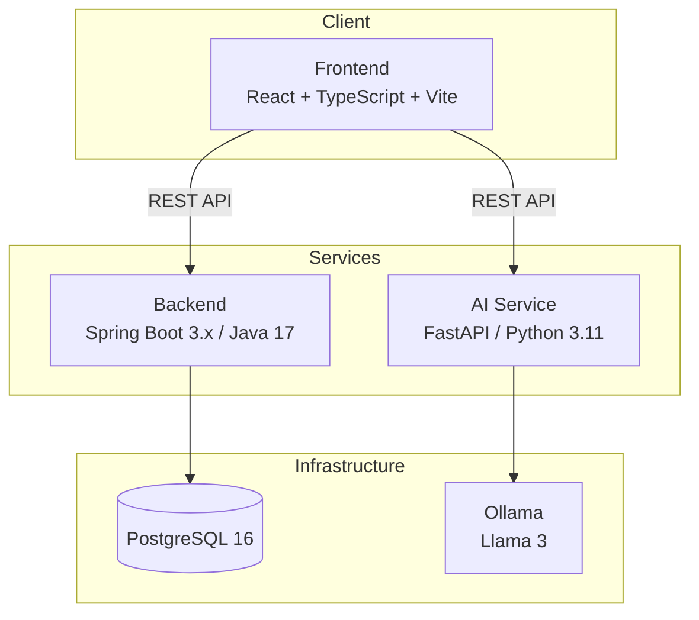

# MemoraAI

> Multimodal AI-powered learning platform for students.

MemoraAI transforms how students learn by ingesting PDFs, presentations, lecture recordings, images, and handwritten notes — then generating personalized quizzes, knowledge graphs, and adaptive study plans powered by local AI.

---

### Current Status: Milestone 3 Complete

*   **Frontend**: React, TypeScript, Tailwind CSS, Lucide Icons, Vite
*   **Backend**: Spring Boot 3, Java 17, PostgreSQL, Maven
*   **AI Service**: FastAPI, Python 3.11, PyPDF2
*   **DevOps**: Docker Compose, multi-container networking
*   **Authentication**: Stateless JWT Authentication, BCrypt Password Hashing, Feature-Based Architecture

---

## Architecture



---

## Technology Stack

| Layer          | Technology                                      |
|----------------|------------------------------------------------|
| Frontend       | React 18, TypeScript, Vite, TailwindCSS         |
| Backend        | Java 21, Spring Boot 3.x, Maven, Spring Web     |
| AI Service     | Python 3.11, FastAPI, Uvicorn, PyTorch, FAISS    |
| Database       | PostgreSQL 16                                    |
| LLM Runtime    | Ollama (Llama 3)                                 |
| Orchestration  | Docker Compose                                   |

---

## Folder Structure

```
MemoraAI/
├── frontend/               # React + TypeScript + Vite
│   └── src/
│       ├── pages/
│       ├── components/
│       ├── layouts/
│       ├── hooks/
│       ├── services/
│       ├── types/
│       └── utils/
├── backend/                # Spring Boot 3.x
│   └── src/main/java/com/memoraai/
│       ├── config/
│       ├── controller/
│       ├── service/
│       ├── repository/
│       ├── entity/
│       ├── dto/
│       ├── security/
│       ├── exception/
│       └── util/
├── ai-service/             # FastAPI
│   └── app/
│       ├── api/
│       ├── core/
│       ├── services/
│       ├── models/
│       └── utils/
├── docker/                 # Docker configurations
├── docs/                   # Documentation
├── scripts/                # Automation scripts
├── datasets/               # Training datasets
├── models/                 # ML model artifacts
├── research/               # Research notes
├── .github/workflows/      # CI/CD pipelines
├── docker-compose.yml
├── .gitignore
└── README.md
```

---

## Getting Started

### Prerequisites

- Docker & Docker Compose
- Node.js 20+ (for local frontend development)
- Java 21 (for local backend development)
- Python 3.11+ (for local AI service development)

### Docker (Recommended)

Start all services with a single command:

```bash
docker compose up --build
```

| Service     | URL                          |
|-------------|------------------------------|
| Frontend    | http://localhost:5173         |
| Backend     | http://localhost:8080         |
| AI Service  | http://localhost:8000         |
| PostgreSQL  | localhost:5432               |
| Ollama      | http://localhost:11434        |

### Health Checks

```bash
# Backend
curl http://localhost:8080/api/health

# AI Service
curl http://localhost:8000/
```

### Local Development

**Frontend**
```bash
cd frontend
npm install
npm run dev
```

**Backend**
```bash
cd backend
./mvnw spring-boot:run
```

**AI Service**
```bash
cd ai-service
pip install -r requirements.txt
uvicorn app.main:app --reload --port 8000
```

---

## Future Milestones

| Milestone | Description                                         |
|-----------|-----------------------------------------------------|
| 2         | File upload (PDF, PPT, images, audio)                |
| 3         | OCR and speech recognition pipelines                 |
| 4         | Embedding generation and vector storage (FAISS)      |
| 5         | RAG pipeline with Ollama / Llama 3                   |
| 6         | Knowledge graph construction                         |
| 7         | Neural Memory State Engine (NMSE)                    |
| 8         | Adaptive quiz generation                             |
| 9         | Authentication and multi-tenancy                     |
| 10        | Production deployment and monitoring                 |

---

## License

This project is proprietary. All rights reserved.
