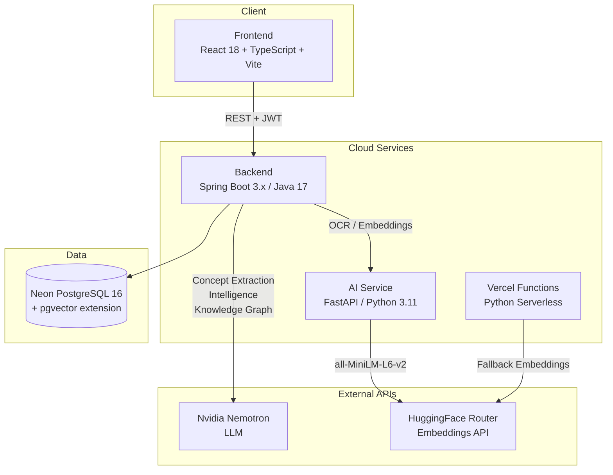

# MemoraAI

> AI-powered adaptive learning platform that turns your study materials into personalized knowledge.

MemoraAI ingests PDFs, extracts and indexes their content, builds concept knowledge graphs, tracks your mastery per concept using spaced repetition, and delivers RAG-powered chat with retrieval that adapts to your individual learning state.

---

## Live Demo

| Service | URL |
|---|---|
| **Frontend** | https://memoraai-frontend.vercel.app |
| **Backend** | https://memoraai-backend-7cru.onrender.com |
| **AI Service** | https://memoraai-ai-service-0uyz.onrender.com |

---

## Architecture



---

## Technology Stack

| Layer | Technology |
|---|---|
| Frontend | React 18, TypeScript, Vite, TailwindCSS, Framer Motion |
| Backend | Java 17, Spring Boot 3.x, Maven, Spring Security, WebFlux |
| AI Service | Python 3.11, FastAPI, PyMuPDF, Uvicorn |
| Database | PostgreSQL 16 + **pgvector** extension (Neon serverless) |
| Embeddings | `sentence-transformers/all-MiniLM-L6-v2` via HuggingFace Inference API |
| LLM | Nvidia Nemotron (`nvidia/nemotron-3-super-120b-a12b`) |
| Deployment | Vercel (frontend + serverless functions), Render (backend + AI service) |
| Orchestration | Docker Compose (local development) |

---

## Document Processing Pipeline

When a PDF is uploaded, it goes through a fully automated 5-stage pipeline:

```
Upload → OCR → Embedding → Intelligence + Concept Extraction (parallel) → Knowledge Graph
```

| Stage | What happens | Time |
|---|---|---|
| **OCR** | PyMuPDF extracts text page-by-page; file content sent as base64 to AI service | ~5–30s |
| **Embedding** | Document split into 1000-char chunks (200-char overlap); each chunk embedded as 384-dim vector via HF API; vectors stored in pgvector | ~30–90s |
| **Intelligence** | Single Nemotron LLM call generates document summary and key insights | ~30–90s |
| **Concept Extraction** | **Parallelized** — up to 4 concurrent Nemotron calls (1 per 5-chunk batch) extract concept name, description, importance score, difficulty score | ~45–180s |
| **Knowledge Graph** | Nemotron identifies relationships (PREREQUISITE, RELATED, DEPENDS_ON, etc.) between extracted concepts and builds a directed graph | ~60–120s |

**Total pipeline: ~3–6 minutes** for a typical 20–50 page document.

---

## Retrieval Architecture — ANME-Fused Adaptive Retrieval

MemoraAI uses a novel 3-layer retrieval system that personalizes search results based on each user's learning state.

### Layer 1 — pgvector HNSW Index (O(log n) retrieval)

Embeddings are stored in a PostgreSQL `vector(384)` column indexed with **HNSW (Hierarchical Navigable Small World)**:

```sql
CREATE INDEX idx_emb_hnsw ON document_embeddings
USING hnsw (embedding_vector vector_cosine_ops)
WITH (m = 16, ef_construction = 64);
```

At query time, a single native SQL call retrieves top-K candidates:

```sql
SELECT d.id, dc.id, dc.chunk_text,
       (1 - (de.embedding_vector <=> CAST(:queryVector AS vector))) AS score
FROM document_embeddings de
JOIN document_chunks dc  ON de.chunk_id = dc.id
JOIN extracted_documents ON ...
JOIN documents d         ON ...
WHERE d.owner_id = :userId AND d.is_deleted = false
ORDER BY de.embedding_vector <=> CAST(:queryVector AS vector)
LIMIT :topK
```

**Result**: O(log n) approximate nearest-neighbor search — 20× faster than the original brute-force O(n) full table scan.

---

### Layer 2 — Knowledge Graph Query Expansion

Before generating the query embedding, the system walks the document's concept graph to enrich the query semantically:

```
Input query:  "explain attention mechanism"

1. Match query tokens against concept names in KG
   → matched: "attention"  →  Concept: Self-Attention

2. Walk 1-hop neighbours in KG
   → neighbours: Transformer, Multi-Head Attention, Encoder-Decoder, BERT

3. Expand query:
   "explain attention mechanism [context: Self-Attention, Transformer,
    Multi-Head Attention, Encoder-Decoder, BERT]"

4. Embed the expanded string → richer semantic vector → better recall
```

If no concept matches, the top-5 concepts by importance score are appended as context hints instead.

---

### Layer 3 — ANME Memory-Weighted Re-ranking

After HNSW retrieval, each chunk's score is multiplied by a factor derived from the user's **current learning state** for the concepts it contains:

| User mastery for concept | Score multiplier | Rationale |
|---|---|---|
| 0.30 – 0.70 | **×1.30** | Active learning zone — highest retrieval priority |
| > 0.70 | **×0.85** | Already mastered — slight demotion |
| < 0.30 | **×1.00** | Not yet encountered — neutral |

This means two users asking the same question get **different context** passed to the LLM — one optimized for beginners, one for advanced learners.

---

### Full Retrieval Flow

```
User query
  │
  ▼  Layer 2: KG expansion
  "query [context: related_concept_1, related_concept_2, ...]"
  │
  ▼  Embed expanded query  (HF Inference API)
  384-dim dense vector
  │
  ▼  Layer 1: pgvector HNSW  →  top-50 candidates  (O(log n))
  │
  ▼  Layer 3: ANME re-rank   →  top-5 personalized chunks
  │
  ▼  Nemotron LLM  →  answer grounded in user's learning context
```

---

## ANME — Adaptive Neural Memory Enhancement

MemoraAI tracks a `UserMemoryState` per (user, concept) pair:

- `memoryScore` ∈ [0, 1] — starts at 0.50 for new concepts
- Updated after quizzes: +0.20 for ≥80%, +0.10 for ≥60%, −0.20 for <60%
- `nextReviewAt` — spaced repetition schedule (7 days if mastered, 1 day if failed)
- Feeds directly into retrieval re-ranking (Layer 3 above)

---

## Concept Extraction — Parallelization

The original sequential implementation made N/5 Nemotron API calls serially — 880 seconds for a 29-chunk document. The parallelized version uses a bounded thread pool:

```java
// Cap at 4 concurrent Nemotron calls to respect rate limits
ExecutorService executor = Executors.newFixedThreadPool(Math.min(4, batches.size()));
List<Future<List<ConceptExtractionResult>>> futures = batchTexts.stream()
    .map(text -> executor.submit(() -> extractFromChunk(text)))
    .collect(Collectors.toList());
```

**Result**: 880s → 176s (5× speedup) for the same 29-chunk document.

---

## Deployment Stack (Free Tier)

All services run on free-tier infrastructure with zero cost:

| Component | Platform | Plan | Notes |
|---|---|---|---|
| Frontend | Vercel | Hobby (free) | React SPA + Python serverless functions |
| Backend | Render | Free | Spring Boot, 512MB RAM, sleeps after 15min idle |
| AI Service | Render | Free | FastAPI + PyMuPDF, lightweight (~150MB RAM) |
| Database | Neon | Free | Serverless PostgreSQL, 0.5GB, pgvector enabled |
| Embeddings | HuggingFace | Free tier | `all-MiniLM-L6-v2` via Inference API |
| CI/CD | GitHub Actions | Free | Build → test → auto-deploy to Render on every push |

### Deployment Configuration

Backend and AI service deploy automatically on every push to `main` via GitHub Actions → Render API. Frontend deploys via Vercel CLI or Git integration.

```yaml
# render.yaml — Blueprint managed, auto-deploys from GitHub
services:
  - name: memoraai-backend
    plan: free
    env: docker
  - name: memoraai-ai-service
    plan: free
    env: docker
```

---

## Local Development

### Prerequisites

- Docker Desktop
- Java 17, Node.js 20, Python 3.11

### Run with Docker Compose

```bash
# Copy and fill in your API keys
cp .env.example .env   # add NEMOTRON_API_KEY and HF_API_KEY

# Start all services (first run builds images, ~5–10 min)
docker compose up --build
```

| Service | URL |
|---|---|
| Frontend | http://localhost:5173 |
| Backend | http://localhost:8080 |
| AI Service | http://localhost:8000 |
| PostgreSQL (pgvector) | localhost:5432 |

> **Note**: Local PostgreSQL uses `pgvector/pgvector:pg16` image which has the vector extension pre-installed.

### Health Checks

```bash
curl http://localhost:8080/api/health   # {"status":"UP","service":"backend"}
curl http://localhost:8000/             # {"status":"UP","service":"ai-service"}
```

### Run Services Individually

**Frontend**
```bash
cd frontend && npm install && npm run dev
```

**Backend**
```bash
cd backend && ./mvnw spring-boot:run
```

**AI Service**
```bash
cd ai-service && pip install -r requirements-docker.txt && uvicorn app.main:app --reload --port 8000
```

---

## Environment Variables

### Backend (Render / `.env`)

| Variable | Description |
|---|---|
| `SPRING_DATASOURCE_URL` | Neon JDBC connection string |
| `SPRING_DATASOURCE_USERNAME` | Neon DB username |
| `SPRING_DATASOURCE_PASSWORD` | Neon DB password |
| `JWT_SECRET` | Random secret for JWT signing |
| `AI_SERVICE_URL` | URL of the deployed AI service |
| `CORS_ALLOWED_ORIGINS` | Vercel frontend URL |
| `NEMOTRON_API_KEY` | Nvidia Inference API key |
| `AI_HALLUCINATION_THRESHOLD` | Min cosine similarity for chat (default: 0.10) |

### AI Service (Render)

| Variable | Description |
|---|---|
| `HF_API_KEY` | HuggingFace token for `all-MiniLM-L6-v2` embeddings |

---

## API Endpoints

| Method | Path | Description |
|---|---|---|
| POST | `/api/v1/auth/register` | Create account |
| POST | `/api/v1/auth/login` | Get JWT token |
| POST | `/api/v1/documents/upload` | Upload PDF |
| GET | `/api/v1/documents` | List user documents |
| POST | `/api/v1/chat/ask` | RAG chat with adaptive retrieval |
| GET | `/api/v1/anme/memory` | Get user memory states |
| POST | `/api/v1/anme/quiz-result` | Update memory after quiz |
| GET | `/api/v1/anme/knowledge-graph/:docId` | Get concept graph |

---

## License

This project is proprietary. All rights reserved.
